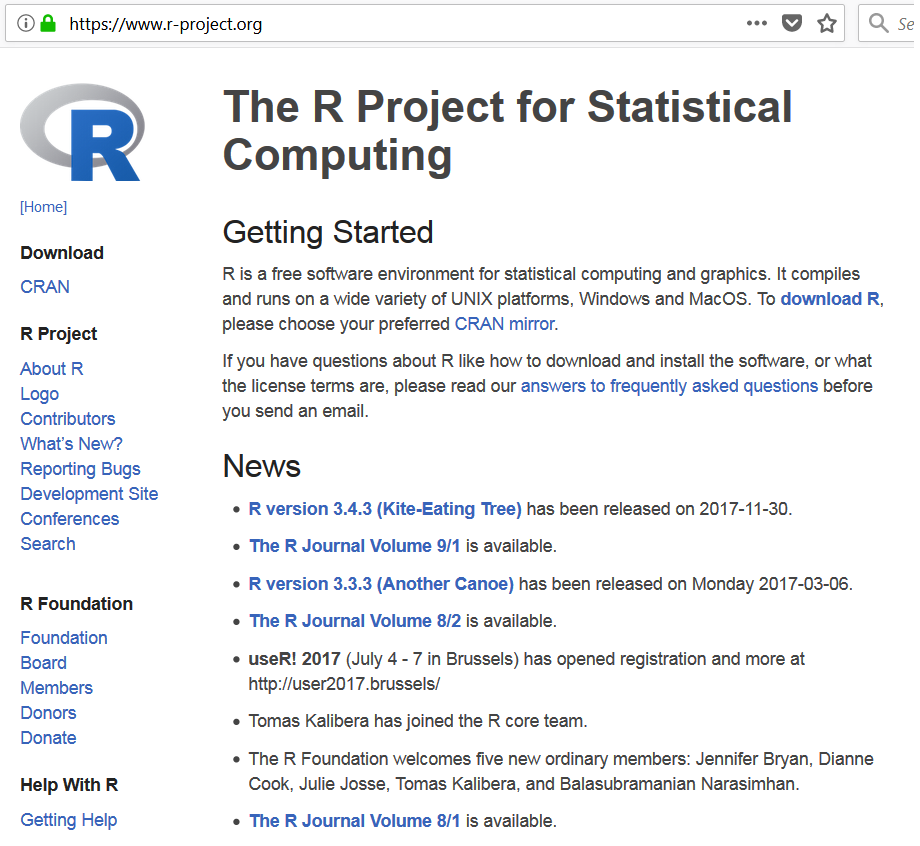
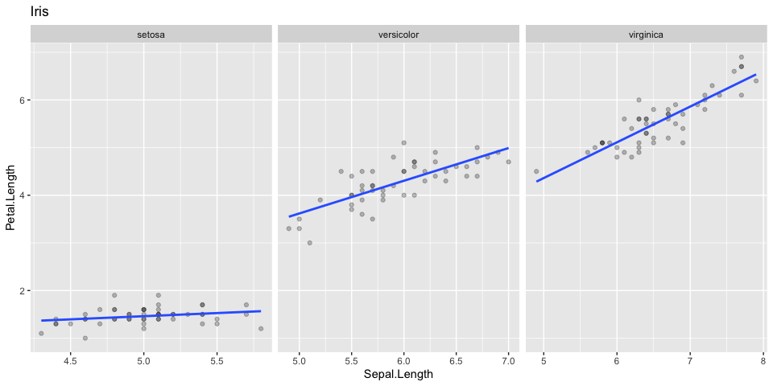
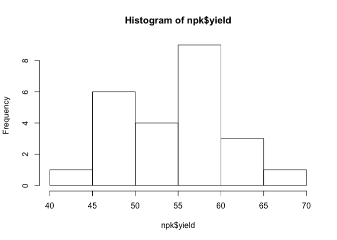
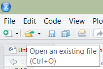

Introduction to R and RStudio
================
TimLanglois
13/01/2020

# Objectives

1.  What is R?
    1.  Why should I use R?
    2.  What can R do?
2.  How do I get started?
    1.  RStudio interface
    2.  How to import, export, and view files
    3.  How to navigate the Help tab
    4.  What are packages?
    5.  How to save files

# What is R?

R is a free, open-source software and programming language developed in
1995 at the University of Auckland as an environment for statistical
computing and graphics [(Ikaha and
Gentleman, 1996)](https://www.stat.auckland.ac.nz/~ihaka/downloads/R-paper.pdf).
Since then R has become one of the dominant software environments for
data analysis and is used by a variety of scientific disiplines,
including fisheries, ecology, and geoinformatics ([Envirometrics CRAN
Task View](https://cran.r-project.org/web/views/Environmetrics.html);
[Spatial CRAN Task
View](https://cran.r-project.org/web/views/Spatial.html)). R is
particularly popular for its graphical capabilities, but it is also
prized for it’s GIS capabilities which make it relatively easy to
generate raster-based models.

1.  a software environment:
      - statistics
      - graphics
      - programming
      - calculator
      - GIS
      - etc…
2.  a language to explore, summarize, and model data
      - functions = verbs
      - objects = nouns

</br>



</br>

## Why Should I Learn R?

While the vast majority of people use Microsoft Excel for data analysis,
R offers numerous advantages, such as:

1.  Cost. R is free\! [(“Free as in free speech, not free
    beer.”)](https://www.gnu.org/philosophy/free-sw.html)

2.  [Reproducible
    Research](http://christophergandrud.github.io/RepResR-RStudio/)
    (*self-documenting, repeatable*)
    
      - repeatable:
          - code + output in a single document *(‘I want the right
            answer, not a quick answer’ - Paul Finnell)*
          - easier the next time ([humorous
            example](https://www.youtube.com/watch?time_continue=1&v=s3JldKoA0zw))
          - numerous Excel horror stories of scientific studies gone
            wrong exist ([TED
            Talk](https://www.youtube.com/watch?v=dXKbkpilQME))
      - scalable: applicable to small or large problems

3.  R in a Community
    
      - [Numerous Discipline Specific R
        Groups](https://cran.r-project.org/web/views/)
      - [Numerous Local R User Groups (including R-Ladies
        Groups)](https://jumpingrivers.github.io/meetingsR/r-user-groups.html#north-america)
      - [Stack Overflow](https://stackoverflow.com/)

4.  Learning Resources *(quantity and quality)*
    
      - [R books](https://www.r-project.org/doc/bib/R-books.html)
      - [(Free Online) R Books](https://bookdown.org/)

5.  R is ‘becoming’ the new norm (paradigm shift?)

While some people find the use of a commandline environment daunting, it
is becoming a necessary skill for scientists as the volume and variety
of data has grown. Thus scripting or programming has become a third
language for many scientists, in addition to their native language and
disipline specific terminology. Other popular programming languages
include: Python (i.e. ArcGIS), and MatLab.

</br>


</br>

## What can R do?

### Packages

  - Base R (*functionality is extended through packages*)
      - basic summaries of quantitative or qualitative data
      - data exploration via graphics
      - [GIS](https://cran.r-project.org/web/views/Spatial.html) data
        processing and analysis
  - [Ecology](https://cran.r-project.org/web/views/Environmetrics.html)
    R packages
      - [vegan](http://vegan.r-forge.r-project.org/) - ordination,
        diversity analysis, etc…
      - [dismo](http://rspatial.org/sdm/) - species distribution
        modeling

#### Draw Depth Plots

Observations: 150 Variables: 5 $ Sepal.Length <dbl> 5.1, 4.9, 4.7, 4.6,
5.0, 5.4, 4.6, 5.0, 4.4, 4.9, 5.4, 4… $ Sepal.Width <dbl> 3.5, 3.0, 3.2,
3.1, 3.6, 3.9, 3.4, 3.4, 2.9, 3.1, 3.7, 3… $ Petal.Length <dbl> 1.4,
1.4, 1.3, 1.5, 1.4, 1.7, 1.4, 1.5, 1.4, 1.5, 1.5, 1… $ Petal.Width <dbl>
0.2, 0.2, 0.2, 0.2, 0.2, 0.4, 0.3, 0.2, 0.2, 0.1, 0.2, 0… $ Species
<fct> setosa, setosa, setosa, setosa, setosa, setosa, setosa, …
<!-- -->

</br>

# RStudio: An Integrated Development Environment (IDE) for R

RStudio is an integrated development environment (IDE) that allows you
to interact with R more readily. RStudio is similar to the standard
RGui, but is considerably more user friendly. It has more drop-down
menus, windows with multiple tabs, and many customization options. The
first time you open RStudio, you will see three windows. A forth window
is hidden by default, but can be opened by clicking the **File**
drop-down menu, then **New File,** and then **R Script.**. Detailed
information on using RStudio can be found at at [RStudio’s
Website](https://support.rstudio.com/hc/en-us/sections/200107586-Using-RStudio).


| RStudio Windows / Tabs | Location    | Description                                                  |
| ---------------------- | ----------- | ------------------------------------------------------------ |
| Console Window         | lower-left  | location were commands are entered and the output is printed |
| Source Tabs            | upper-left  | built-in text editor                                         |
| Environment Tab        | upper-right | interactive list of loaded R objects                         |
| History Tab            | upper-right | list of key strokes entered into the Console                 |
| Files Tab              | lower-right | file explorer to navigate C drive folders                    |
| Plots Tab              | lower-right | output location for plots                                    |
| Packages Tab           | lower-right | list of installed packages                                   |
| Help Tab               | lower-right | output location for help commands and help search window     |
| Viewer Tab             | lower-right | advanced tab for local web content                           |

## Basic Tips for using R

  - R is command-line driven. It requires you to type or copy-and-paste
    commands after a command prompt (\>) that appears when you open R.
    After typing a command in the R console and pressing **Enter** on
    your keyboard, the command will run. If your command is not
    complete, R issues a continuation prompt (signified by a plus sign:
    `+`). Alternatively you can write a script in the script window, and
    select a command, and click the **Run** button.

  - R is case sensitive. Make sure your spelling and capitalization are
    correct.

  - Commands in R are also called functions. The basic format of a
    function in R is: `object <- function.name(argument_1 = data,
    argument_2 = TRUE)`.  

  - The up arrow (^) on your keyboard can be used to bring up previous
    commands that you’ve typed in the R console.

  - The `$` symbol is used to select a particular column within the
    table (e.g., `table$column`).

  - Any text that you do not want R to act on (such as comments, notes,
    or instructions) needs to be preceded by the `#` symbol (a.k.a.
    hash-tag, comment, pound, or number symbol). R ignores the remainder
    of the script line following `#`. For example: `plot(x, y) # This
    text will not affect the plot function because of the comment`
    \`\`\`

### Brief Example

``` r
# Addition
1 + 1
```

\[1\] 2

``` r
# Multiplication
10 * 10
```

\[1\] 100

``` r
# Compute Logarithm
log10(100)
```

\[1\] 2

``` r
# Print Text
"Hello World"
```

\[1\] “Hello World”

``` r
# Plot Histogram
hist(npk$yield)
```

<!-- -->

``` r
# Assignment
test <- 1

# or

test = 1
```

## Data Management in RStudio

Before you begin working in R, you should set your working directory (a
folder to hold all of your project files); for example,
“C:\\workspace2\\…”. This directory is the location where all your
input data-sets are be stored. It also serves as the default location
for plots and other objects exported from R. If set, it conviently
allows you to import data into R with just a file name, not the entire
file path.

Typically at the beginning of each R session you should set your working
directory. To change the working directory in RStudio, select the
**Files Tab \> More \> Set As Working Directory**.

To check the file path of the current working directory (which should
now be “C:\\workspace2”), type:

``` r
getwd()
```

### Importing Data

After your working directory is set, you can import data from .csv,
.txt, etc. One basic command for importing data into R is `read.csv()`.
The command is followed by the file name and then some optional
instructions for how to read the file.

#### Note on Microsoft Excel files

R can import Excel files, but generally speaking it is a bad idea to use
Excel. Excel has a dangerous default which automatically converts data
with common notations to their standard format without warning or
notice. For example, the character “11-JUN” entered into a cell
automatically becomes the date 6/11/2017, even though the data is still
displayed as 11-JUN. The only way to avoid this default behavior is to
manually import your data into Excel via the **Data Tab\>Get External
Data Ribbon**, and manually set the data type of all your columns to
text. Failure to do so has resulted in numerous retracted research
articles ([Washington Post
Article](https://www.washingtonpost.com/news/wonk/wp/2016/08/26/an-alarming-number-of-scientific-papers-contain-excel-errors/?utm_term=.9352a35dca6f)).

### Exporting Data

To export data from R, use the command `write.csv()` function. Since we
have already set our working directory, R automatically saves our file
into the working directory.

## Getting Help

R has [extensive
documentation](https://cran.r-project.org/manuals.html), numerous
[mailing lists](https://www.r-project.org/mail.html), and [countless
books](https://www.r-project.org/doc/bib/R-books.html) (many of which
are free and listed at end of each chapter for this course). The built
in help files are sometimes cryptic, and the online replies can be
terse, but if you seek help you shall find it. To learn more about the
function you are using and the options and arguments available, learn to
help yourself by taking advantage of some of the following help
functions in RStudio:

1.  Use the Help tab in the lower-right Window to search commands (such
    as hist) or topics (such as histogram).


2.  Type `help(read.csv) or ?read.csv` in the Console window to bring up
    a help page. Results will appear in the Help tab in the lower-right
    hand window. Certain functions may require quotations, such as
    `help("+")`.

<!-- end list -->

``` r
# Help file for a function
help(read.csv) # or ?read.csv

# Help files for a package
help(package = "soiltexture")
```

## Packages

Packages are collections of additional functions that can be loaded on
demand. They commonly include example data that can be used to
demonstrate those functions. Although R comes with many common
statistical functions and models, most of our work requires additional
packages.

### Installing Packages

To use a package, you must first install it and then load it. These
steps can be done at the command line or using the Packages Tab.
Examples of both approaches are provided below. R packages only need to
be installed once (until R is upgraded or re-installed). Every time you
start a new R session, however, you need to load every package that you
intend to use in that session.

Within the **Packages** tab you will see a list of all the packages
currently installed on your computer, and 2 buttons labeled either
“Install” or “Update”. To install a new package simply select the
**Install** button. You can enter install one or more than one packages
at a time by simply separating them with a comma.

To find out what packages are installed on your computer, use the
following commands:

``` r
library() 

# or

installed.packages()
```

One extremely useful package for data management and manipulation is
dplyr(). The following command shows how to install this package if you
do not have currently have it downloaded:

``` r
# CRAN (static version)
installed.packages( "dplyr")
```

### Loading Packages

Once a package is installed, it must be loaded into the R session to be
used.

``` r
library(dplyr)
```

## Writing Scripts

RStudio’s Source Tabs serve as a built-in text editor. Prior to excuting
R functions at the Console, commands are typically written down (or
scripted). Scripting is essentially showing your work. The sequence of
functions necessary to complete a task are scripted in order to document
or automate a task. While scripting may seems cumbersome at first, it
ultimately saves time in the long run, particularly for repetitive tasks
([humorous YouTube Video on
Scripting](https://www.youtube.com/watch?time_continue=1&v=s3JldKoA0zw)).
Benefits include:

  - allows others to reproduce your work, which is the foundation of
    science
  - serves as instruction/reminder on how to perform a task
  - allows rapid iteration, which saves time and allows the evaluation
    of incremental changes
  - reduces the chance of human error

### Basic Tips of Scripting

To write a script, simply open a new R script file by clicking
**File\>New File\>R Script**. Within the text editor **type** out a
sequence of functions.

  - Place each function (e.g. `read.csv()`) on a separate line.
  - If a function has a long list of arguments, place each argument on a
    separate line.
  - A command can be excuted from the text editor by placing the cursor
    on a line and typing **Crtl + Enter**, or by **clicking** the Run
    button.
  - An entire R script file can be excuted by **clicking** the Source
    button.


## Saving R Files

In R, you can save several types of files to keep track of the work you
do. The file types include: workspace, script, history, and graphics. It
is important to save often because R, like any other software, may crash
periodically. Such problems are especially likely when working with
large files. You can save your workspace in R via the command line or
the File menu.

### R script (.R)

An R script is simply a text file of R commands that you’ve typed.

You may want to save your scripts (whether they were written in R Editor
or another program such as Notepad) so that you can reference them in
the future, edit them as needed, and keep track of what you’ve done. To
save R scripts in RStudio, simply **click the save button** from your R
script tab. Save scripts with the .R extension. R assumes that script
files are saved with only that extension. If you are using another text
editor, you won’t need to worry about saving your scripts in R. You can
open text files in the RStudio text editor, but beware copying and
pasting from Word files as discussed below.


To open an R script, **click the file icon**.



#### Note on Microsoft Word Files

Using Microsoft Word to write or save R scripts is generally a bad idea.
Certain keyboard characters, such as quotations "“, are not stored the
same in Word (e.g.”" vs. ""). The difference is largely
indistinguishable to the human eye, but will not run in R.

### R Graphics

Graphic outputs can be saved in various formats.

| Format          | Function                    |
| :-------------- | :-------------------------- |
| pdf             | pdf(“graphic.pdf”)          |
| window metafile | win.metafile(“graphic.wmf”) |
| png             | png(“graph.png”)            |
| jpeg            | jpeg(“graph.jpg”)           |
| bmp             | bmp(“graph.bmp”)            |
| postscript      | postscript(“graph.ps”)      |

To save a graphic: (1) Click the **Plots Tab** window, (2) click the
**Export** button, (3) **Choose** your desired format, (3) **Modify**
the export settings as you desire, and (4) click **Save**.

# Review

Given what you now know about R, try to answer the following questions:

1.  Can you think of a situation where an existing hypothesis or
    convientional wisdom was not repeatable?

2.  What are packages?

3.  What is GitHub?

4.  Where can you get help?

# Additional Readings

  - Introductory R Books
      - [Quick-R](https://www.statmethods.net/)
      - [R Cookbook](http://www.cookbook-r.com/)
      - [Reproducible Research with R & RStudio (not
        free)](http://christophergandrud.github.io/RepResR-RStudio/)

# References

Ihaka, R., and R. Gentleman. 1996. R: A language for data analysis and
graphics. Journal of Computational and Graphical Statistics
5(3):399–314.
<https://www.stat.auckland.ac.nz/~ihaka/downloads/R-paper.pdf>
